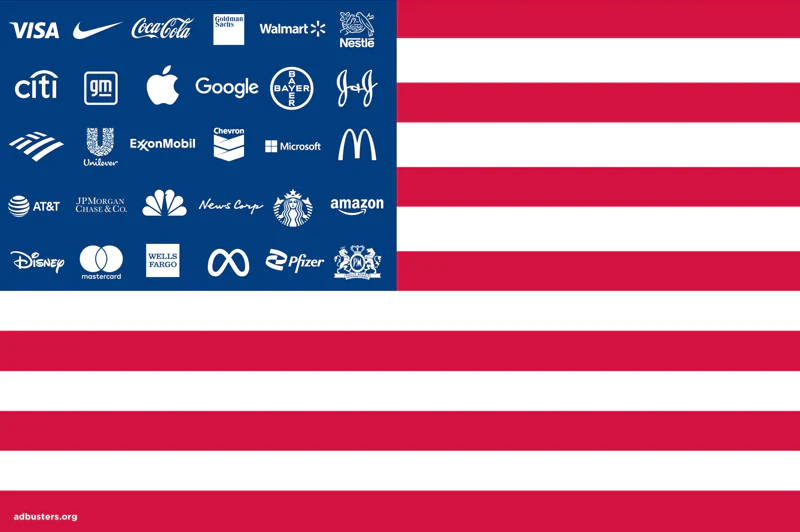

# `</branding>`

 

<small>Adbusters' Corporate American Flag (2023)</small>   

## Introduction

Reimagine a corporate message using critical web design.

Learning Objectives

Students who complete this assignment will be able to:

- Compare [Dunne and Raby's A/B columns](assets/img/dunn-raby-a-b.png) e.g. critical design vs. commercial design
- Identify aspects of an organization's brand and identity including logo, wordmark, and logo lockup.
- Design a web page in Figma
- Demonstrate how to use @font-face and online type services like Google Fonts to style text in a web page.
- Implement a click event listener in Javascript.

Preparation

Complete the following to prepare for this assignment: 

- Chapter 3 of Critical Web Design
- Course content listed on the schedule

Rubric

See Moodle.

## Setup

[Fork](https://docs.github.com/en/get-started/quickstart/fork-a-repo#forking-a-repository) this repository and [clone](https://docs.github.com/en/get-started/quickstart/fork-a-repo#cloning-your-forked-repository) it to your machine.

## Inspiration

- Critical Web Design Chapter 3 examples: [Monopoly](https://omundy.github.io/critical-web-design-book/03-critical-design/examples/adobe-monopoly) and [Time](https://omundy.github.io/critical-web-design-book/03-critical-design/examples/ikea-time/)
- [First Things First Manifesto 1960](http://www.designishistory.com/1960/first-things-first/) and [2020](https://www.eyemagazine.com/feature/article/first-things-first-manifesto-2000)
- Adbusters collection of [spoof ads](https://www.adbusters.org/spoof-ads)
- [stupidhackathon.com](https://stupidhackathon.com) (2015) organized by Sam Lavigne & Amelia Winger-Bearskin
- [Safebook](https://bengrosser.com/projects/safebook/) (2018) by Ben Grosser
- [unfitbits.com](unfitbits.com) (2015) by Tega Brain and Surya Mattu
- [adnauseam.io](https://adnauseam.io/)
- [add-art](https://add-art.org/) (2011) by Steve Lambert, et al
- [termsandconditions.game](https://www.termsandconditions.game) 

## Design

Follow the prompt in Chapter 3 of Critical Web Design to create a design that unbrands a corporate identity. 

## Code

Follow the prompt in Chapter 3 of Critical Web Design to:

1. Code your design in HTML/CSS/JS
1. Use @font-face or an online font service to match the identity
1. Use Javascript `mouseover` and/or CSS `:hover` to add interactivity to the page
1. Write a short statement explaining your motivation and intentions. Log it, as well as any sources you used in your research about the company, to the console using `console.log()`

## Publish

1. [Save and refresh](https://github.com/omundy/learn-computing/blob/main/topics/keyboard-shortcuts.md#web-development-edit-save-refresh-loop) your work in the browser often to see your changes.
1. Commit changes regularly.
1. Confirm valid [HTML](https://validator.w3.org/) and [CSS](https://jigsaw.w3.org/css-validator/) ([?](https://github.com/omundy/dig245-critical-web-design/blob/main/topics/html-css/css.md#css-validation))
1. When finished, push, publish, and post all deliverables to Moodle per documentation in the Assignments.

## Resources

- Course references [HTML](https://github.com/omundy/dig245-critical-web-design/blob/main/topics/html-css/html.md), [CSS](https://github.com/omundy/dig245-critical-web-design/blob/main/topics/html-css/css.md), and [JS](https://github.com/omundy/dig245-critical-web-design/blob/main/topics/javascript/javascript.md)
- [Mozilla Developer Guides](https://developer.mozilla.org/en-US/docs/Web/Guide)
